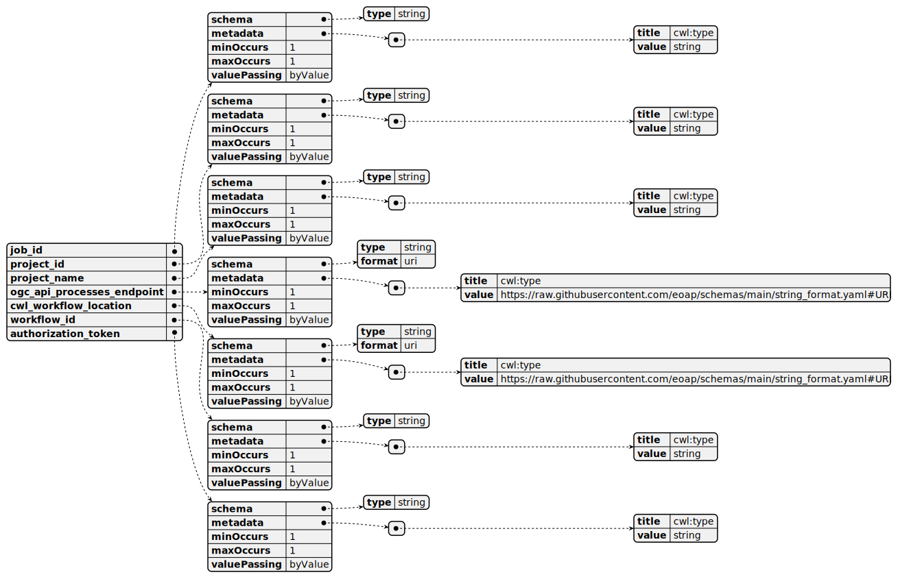
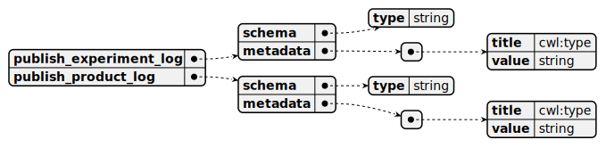
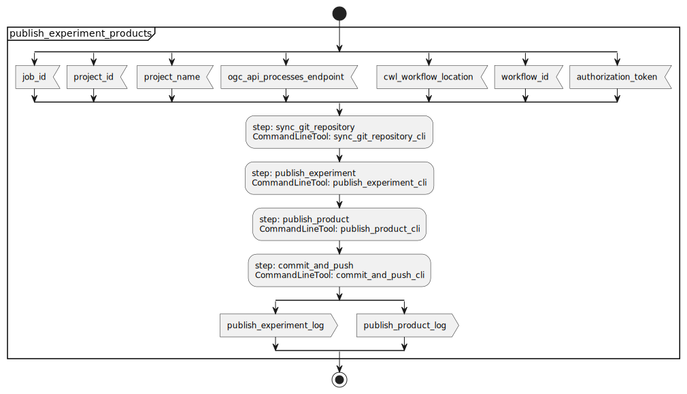
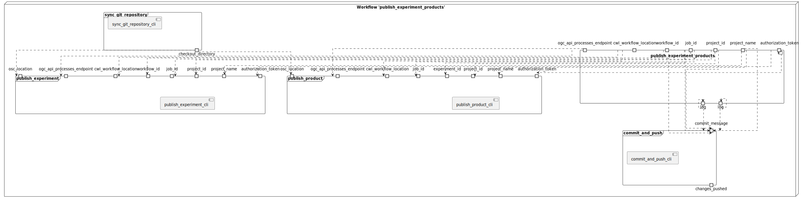
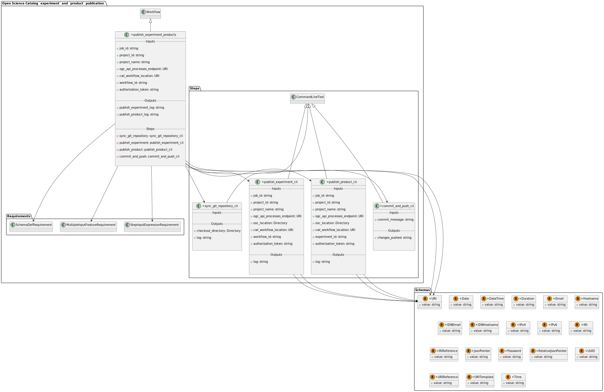
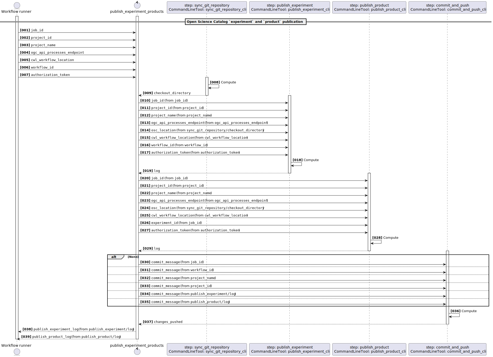
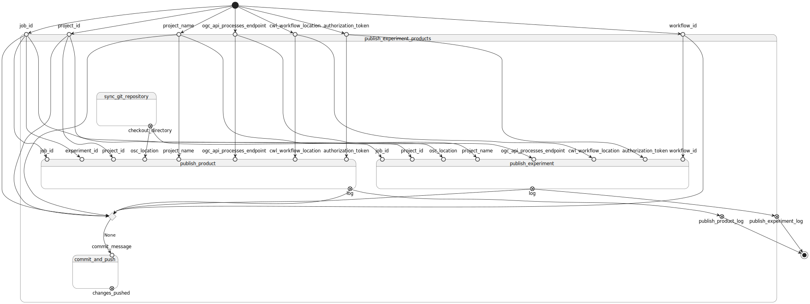

# OSC Client - Publish `experiment` and `product` v0.1.0

ESA Open Science Catalog Client

> This software is licensed under the terms of the [Apache License 2.0](https://www.apache.org/licenses/LICENSE-2.0) license - SPDX short identifier: [Apache-2.0](https://spdx.org/licenses/Apache-2.0)
>
> 2026-05-12 - 2026-05-19T15:46:21.620 Copyright [Terradue Srl](mailto:info@terradue.com) - > [https://ror.org/0069cx113](https://ror.org/0069cx113)

## Project Team

### Authors

| Name | Email | Organization | Role | Identifier |
|------|-------|--------------|------|------------|
| Brito, Fabrice | [fabrice.brito@terradue.com](mailto:fabrice.brito@terradue.com) | [Terradue](https://ror.org/0069cx113) | [Project Manager](http://purl.org/spar/datacite/ProjectManager) | [https://orcid.org/0009-0000-1342-9736](https://orcid.org/0009-0000-1342-9736) |
| Tripodi, Simone | [simone.tripodi@terradue.com](mailto:simone.tripodi@terradue.com) | [Terradue](https://ror.org/0069cx113) | [Project Leader](http://purl.org/spar/datacite/ProjectLeader) | [https://orcid.org/0009-0006-2063-618X](https://orcid.org/0009-0006-2063-618X) |


### Contributors

The are no contributors for this project.


## User Manual

User Manual can be found on [https://terradue.github.io/osc-client/](https://terradue.github.io/osc-client/).


## Runtime environment

### Supported Operating Systems

- Linux
- MacOS X

### Requirements

- [https://cwltool.readthedocs.io/en/latest/](https://cwltool.readthedocs.io/en/latest/)
- [https://www.python.org/](https://www.python.org/)


## Software Source code

- Browsable version of the [source repository](https://github.com/Terradue/osc-client.git);
- [Continuous integration](https://github.com/Terradue/osc-client/actions) system used by the project;
- Issues, bugs, and feature requests should be submitted to the following [issue management](https://github.com/Terradue/osc-client/issues) system for this project


---


## publish_experiment_products

### CWL Class

[Workflow](https://www.commonwl.org/v1.2/Workflow.html#Workflow)

### Requirements

* [MultipleInputFeatureRequirement](https://www.commonwl.org/v1.2/Workflow.html#MultipleInputFeatureRequirement)
* [SchemaDefRequirement](https://www.commonwl.org/v1.2/Workflow.html#SchemaDefRequirement)
* [StepInputExpressionRequirement](https://www.commonwl.org/v1.2/Workflow.html#StepInputExpressionRequirement)

### Inputs

| Id | Type | Label | Doc |
|----|------|-------|-----|
| `job_id` | [string](https://www.commonwl.org/v1.2/Workflow.html#CWLType) | None | None |
| `project_id` | [string](https://www.commonwl.org/v1.2/Workflow.html#CWLType) | None | None |
| `project_name` | [string](https://www.commonwl.org/v1.2/Workflow.html#CWLType) | None | None |
| `ogc_api_processes_endpoint` | [URI](https://raw.githubusercontent.com/eoap/schemas/main/string_format.yaml#URI):<ul><li>`value`: [string](https://www.commonwl.org/v1.2/Workflow.html#CWLType)</li></ul> | None | None |
| `cwl_workflow_location` | [URI](https://raw.githubusercontent.com/eoap/schemas/main/string_format.yaml#URI):<ul><li>`value`: [string](https://www.commonwl.org/v1.2/Workflow.html#CWLType)</li></ul> | None | None |
| `workflow_id` | [string](https://www.commonwl.org/v1.2/Workflow.html#CWLType) | None | None |
| `authorization_token` | [string](https://www.commonwl.org/v1.2/Workflow.html#CWLType) | None | None |


### Steps

| Id | Runs | Label | Doc |
|----|------|-------|-----|
| [sync_git_repository](#sync_git_repository_cli) | `#sync_git_repository_cli` | None | None |
| [publish_product](#publish_product_cli) | `#publish_product_cli` | None | None |
| [publish_experiment](#publish_experiment_cli) | `#publish_experiment_cli` | None | None |
| [commit_and_push](#commit_and_push_cli) | `#commit_and_push_cli` | None | None |


### Outputs

| Id | Type | Label | Doc |
|----|------|-------|-----|
| `publish_experiment_log` | [string](https://www.commonwl.org/v1.2/Workflow.html#CWLType) | None | None |
| `publish_product_log` | [string](https://www.commonwl.org/v1.2/Workflow.html#CWLType) | None | None |


### OGC API - Processes

When `publish_experiment_products` [Workflow](https://www.commonwl.org/v1.2/Workflow.html#Workflow) is exposed through [OGC API - Processes - Part 1: Core](https://docs.ogc.org/is/18-062r2/18-062r2.html), `inputs` and `outputs` fields below represent the interface of the [getProcessDescription](https://developer.ogc.org/api/processes/index.html#tag/ProcessDescription/operation/getProcessDescription) API. 


#### Inputs



#### Outputs




### UML Diagrams


#### Activity diagram

Learn more about the [Activity diagram](https://en.wikipedia.org/wiki/Activity_diagram) below.



#### Component diagram

Learn more about the [Component diagram](https://en.wikipedia.org/wiki/Component_diagram) below.



#### Class diagram

Learn more about the [Class diagram](https://en.wikipedia.org/wiki/Class_diagram) below.



#### Sequence diagram

Learn more about the [Sequence diagram](https://en.wikipedia.org/wiki/Sequence_diagram) below.



#### State diagram

Learn more about the [State diagram](https://en.wikipedia.org/wiki/State_diagram) below.




### Run in step

`sync_git_repository`


## sync_git_repository_cli

### CWL Class

[CommandLineTool](https://www.commonwl.org/v1.2/CommandLineTool.html#CommandLineTool)

### Inputs

| Id | Option | Type |
|----|------|-------|

### Execution usage example:

```
bash run.sh \
```

### Run in step

`publish_product`


## publish_product_cli

### CWL Class

[CommandLineTool](https://www.commonwl.org/v1.2/CommandLineTool.html#CommandLineTool)

### Inputs

| Id | Option | Type |
|----|------|-------|
| `job_id` | `--id` | [string](https://www.commonwl.org/v1.2/Workflow.html#CWLType) |
| `project_id` | `--project-id` | [string](https://www.commonwl.org/v1.2/Workflow.html#CWLType) |
| `project_name` | `--project-name` | [string](https://www.commonwl.org/v1.2/Workflow.html#CWLType) |
| `ogc_api_processes_endpoint` | `--ogc-api-processes-endpoint` | [URI](https://raw.githubusercontent.com/eoap/schemas/main/string_format.yaml#URI):<ul><li>`value`: [string](https://www.commonwl.org/v1.2/Workflow.html#CWLType)</li></ul> |
| `osc_location` | `--output` | [Directory](https://www.commonwl.org/v1.2/Workflow.html#Directory) |
| `cwl_workflow_location` | `--cwl_workflow_location` | [URI](https://raw.githubusercontent.com/eoap/schemas/main/string_format.yaml#URI):<ul><li>`value`: [string](https://www.commonwl.org/v1.2/Workflow.html#CWLType)</li></ul> |
| `experiment_id` | `--experiment-id` | [string](https://www.commonwl.org/v1.2/Workflow.html#CWLType) |
| `authorization_token` | `--authorization-token` | [string](https://www.commonwl.org/v1.2/Workflow.html#CWLType) |

### Execution usage example:

```
uv run --no-cache --no-project --with osc-client osc-client <ARGUMENT_DYNAMICALLY_SET> \
--id <JOB_ID> \
--project-id <PROJECT_ID> \
--project-name <PROJECT_NAME> \
--ogc-api-processes-endpoint <OGC_API_PROCESSES_ENDPOINT> \
--output <OSC_LOCATION> \
--cwl_workflow_location <CWL_WORKFLOW_LOCATION> \
--experiment-id <EXPERIMENT_ID> \
--authorization-token <AUTHORIZATION_TOKEN>
```

### Run in step

`publish_experiment`


## publish_experiment_cli

### CWL Class

[CommandLineTool](https://www.commonwl.org/v1.2/CommandLineTool.html#CommandLineTool)

### Inputs

| Id | Option | Type |
|----|------|-------|
| `job_id` | `--id` | [string](https://www.commonwl.org/v1.2/Workflow.html#CWLType) |
| `project_id` | `--project-id` | [string](https://www.commonwl.org/v1.2/Workflow.html#CWLType) |
| `project_name` | `--project-name` | [string](https://www.commonwl.org/v1.2/Workflow.html#CWLType) |
| `ogc_api_processes_endpoint` | `--ogc-api-processes-endpoint` | [URI](https://raw.githubusercontent.com/eoap/schemas/main/string_format.yaml#URI):<ul><li>`value`: [string](https://www.commonwl.org/v1.2/Workflow.html#CWLType)</li></ul> |
| `osc_location` | `--output` | [Directory](https://www.commonwl.org/v1.2/Workflow.html#Directory) |
| `cwl_workflow_location` | `--cwl_workflow_location` | [URI](https://raw.githubusercontent.com/eoap/schemas/main/string_format.yaml#URI):<ul><li>`value`: [string](https://www.commonwl.org/v1.2/Workflow.html#CWLType)</li></ul> |
| `workflow_id` | `--workflow-id` | [string](https://www.commonwl.org/v1.2/Workflow.html#CWLType) |
| `authorization_token` | `--authorization-token` | [string](https://www.commonwl.org/v1.2/Workflow.html#CWLType) |

### Execution usage example:

```
uv run --no-cache --no-project --with osc-client osc-client <ARGUMENT_DYNAMICALLY_SET> \
--id <JOB_ID> \
--project-id <PROJECT_ID> \
--project-name <PROJECT_NAME> \
--ogc-api-processes-endpoint <OGC_API_PROCESSES_ENDPOINT> \
--output <OSC_LOCATION> \
--cwl_workflow_location <CWL_WORKFLOW_LOCATION> \
--workflow-id <WORKFLOW_ID> \
--authorization-token <AUTHORIZATION_TOKEN>
```

### Run in step

`commit_and_push`


## commit_and_push_cli

### CWL Class

[CommandLineTool](https://www.commonwl.org/v1.2/CommandLineTool.html#CommandLineTool)

### Inputs

| Id | Option | Type |
|----|------|-------|
| `commit_message` | `--commit_message` | [string](https://www.commonwl.org/v1.2/Workflow.html#CWLType) |

### Execution usage example:

```
bash run.sh \
--commit_message <COMMIT_MESSAGE>
```

