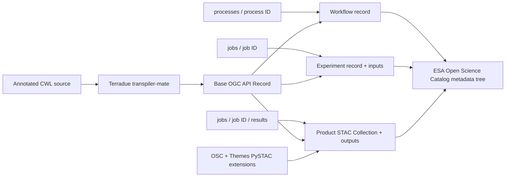

# Architecture

`osc-metadata-client` is intentionally a simple conversion connector between a
processing service and the ESA Open Science Catalog. It does not execute CWL,
serve OGC APIs, or publish the final catalog.

## Conversion flow

The `workflow` path associates the CWL-derived record with an OGC API -
Processes process. The `experiment` path reads the corresponding job status and
inputs. The `products` path reads the successful job result. Together they map
the processing lifecycle to the catalog's workflow, experiment, and product
resources.

## Why `transpiler-mate` is a dependency

Terradue's [transpiler-mate](https://terradue.github.io/transpiler-mate/) already
provides the reusable metadata layer: it extracts Schema.org
`SoftwareApplication` metadata from annotated CWL and transpiles it to OGC API
Records. Reusing that API keeps this client focused on Open Science Catalog
concerns:

- catalog resource types and relationships;
- OGC API - Processes process, job, and result links;
- job inputs, outputs, and provenance;
- catalog directory layout and parent catalogs.

## Why the PySTAC implementations live here

PySTAC does not provide built-in implementations for every community extension.
This project therefore implements the published
[OSC](https://github.com/stac-extensions/osc) and
[Themes](https://github.com/stac-extensions/themes) specifications using
PySTAC's extension framework.

The implementations are more than JSON helpers: they register versioned schema
URIs and extension hooks, enforce supported STAC object types, expose typed
properties and enums, and support read/write round trips. Product creation uses
these APIs to construct standards-aligned STAC Collections.

## System boundaries

The client reads CWL from HTTP(S), `file://`, or OCI and reads job information
from an OGC API - Processes service. It writes local JSON and YAML files. A
separate process remains responsible for deploying the workflow, creating the
job, publishing the generated files, and serving the Open Science Catalog.
